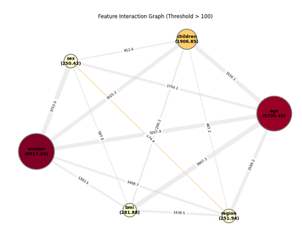

# Localized CBFI: Beyond Feature Attribution 

An official Python implementation of **Localized Case-Based Feature Importance (CBFI)**, a model-agnostic XAI framework designed to expose the latent interaction structures embedded within complex machine learning models.

Instead of merely distributing numerical "payouts" like traditional additive frameworks (SHAP, LIME), Localized CBFI shifts the explainable AI paradigm from simple importance attribution to the **recovery of interaction-driven structures**.

---

##  Key Differences from Additive Approaches (SHAP / LIME)

* **The Additive Fallacy:** Traditional methods often absorb complex, non-linear interactions into single feature scores, smoothing over the structural logic that governs the model's decision manifold.
* **Taxonomic Separation:** Localized CBFI structurally isolates independent **Main Effects ($G_1$)** from pure, context-dependent **Synergistic Interactions ($G_4$)** at the individual instance level.
* **High-Resolution SNR:** Achieves up to **1,952.7x higher sensitivity** in isolating pure interactions compared to baseline metrics, eliminating numerical noise.
* **Meaning-Based Interpretation:** Outputs are presented in non-normalized, absolute scales (e.g., direct probability shifts or real-world currency units `$`) for intuitive high-stakes auditing.

---

##  Internal Mechanism

Localized CBFI partitions instance-level feature contributions into distinct, mutually exclusive structural components:

* **Main Effect ($G_1$):** The independent drive of a feature, isolated from any variable coupling.
* **Interaction ($G_4$):** The pure synergy or regulatory suppression that emerges only through the joint presence of multiple features. 
  * $G_4 > 0$: Synergistic Interaction (cooperative feature reinforcement).
  * $G_4 < 0$: Regulatory/Suppressive Interaction (contextual attenuation).

---

##  Evaluation & Performance

Extensively benchmarked across **36 distinct model-dataset combinations** (including Random Forest, XGBoost, CatBoost, and TabNet) spanning high-stakes domains like healthcare, finance, and real-estate.

* **Fidelity & Binding Requirements:** Fidelity tests confirm that Localized CBFI correctly identifies the "binding requirements" of features—proving that decision structures often break down only when the entire interaction network is neutralized, rather than single marginal variables.
* **Computational Efficiency:** Leverages a case-based sampling strategy that maintains **linear scalability** with respect to the number of features. Achieves **sub-second runtimes (<1.0s)** per instance, making it highly feasible for real-time database system integration.

---

##  Latent Interaction Graph

By aggregating pairwise $G_4$ strength across instances, Localized CBFI explicitly maps out how predictive signals propagate through interconnected feature relationships, uncovering the hidden structural topology of black-box architectures.

