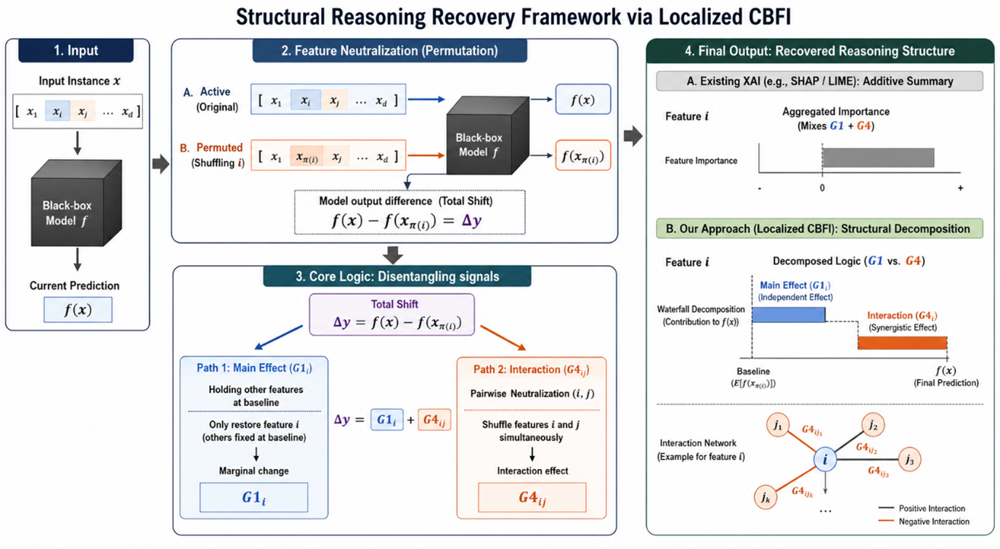
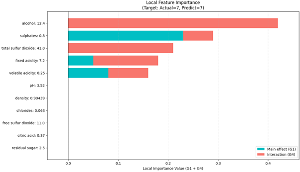

# Beyond Feature Attribution: Recovering Latent Interaction Structures via Localized CBFI



An official Python implementation of **Localized Case-Based Feature Importance (CBFI)**, a model-agnostic explainable AI (XAI) framework designed to expose the latent interaction structures embedded within complex machine learning models. 

Instead of merely distributing numerical "payouts" like traditional additive frameworks (SHAP, LIME), Localized CBFI shifts the explainable AI paradigm from simple importance attribution to the **recovery of interaction-driven structures**.

---

## 📝 Description

Localized CBFI overcomes the structural limitations of existing additive explanation models by explicitly decomposing feature interactions at the individual instance level. Traditional methods often absorb complex, non-linear interactions into single feature scores, smoothing over the structural logic that governs the model's decision manifold. 

This framework structurally isolates independent **Main Effects ($G_1$)** from pure, context-dependent **Synergistic Interactions ($G_4$)** at the individual instance level. It provides objective, high-resolution diagnostic maps of a model's internal decision mechanisms, making it vital for high-stakes domains where understanding the internal logic is as essential as predictive accuracy.



---

## 📊 Dataset Information

The experimental pipeline integrates public datasets characterized by distinct domain attributes and complex nonlinear relationships:

1. **Wine Quality Dataset (Cortez et al., 2009)**: Consists of red wine samples with 11 chemical properties (acidity, residual sugar, alcohol, etc.). It is ideal for analyzing regulatory mechanisms ($G_4$) where final grades are determined by the delicate balance and interdependence between multiple components rather than single independent marginal variables.
2. **Medical Insurance Dataset (Lantz, 2013)**: Predicts annual medical charges based on individual attributes (age, BMI, smoking status). It features a strong nonlinear dependency structure where the combination of specific risk factors creates exponential synergies.
3. **Multi-domain Benchmarks**: Extensively validated across various high-stakes domains including finance, healthcare, and real estate (e.g., Ames Housing, Adult, Bike Sharing, and Diabetes datasets).

---

## 💻 Code Information

The core backend pipeline resides in `local_cbfi_clean_20260410.py` and provides a comprehensive explanation engine along with advanced visualization suites:

* **Core Explanation Engines**: 
  * `explain_local_cbfi_classification_conditional()`: Decomposes instance-level classification predictions into structural groups using conditional permutation sampling.
  * `explain_local_cbfi_regression_conditional()`: Restores regression error-reduction trajectories by reflecting the structural decision tree logic.
* **Neighborhood Estimators**: 
  * `_get_conditional_samples()`: Extracts a localized neighborhood sample pool based on feature correlations and KNN to preserve the learned data manifold.
* **Interaction Mapping**: 
  * `get_local_pairwise_interaction()` & `generate_all_interactions()`: Evaluate structural interaction topologies across unique feature pairs.
* **Visualization Tools**: Includes high-resolution plotting wrappers for bar attribution summaries (`visualize_feature_contribution`), 1:1 local dependencies (`visualize_local_pairwise_interaction`), and network structures (`visualize_feature_interaction_graph`, `visualize_draggable_interaction_graph`).

---

## ⚙️ Requirements

The entire framework and experimental pipelines are implemented using Python (v3.14+). Ensure the following dependencies are installed:

```bash
numpy >= 2.4.3
pandas >= 2.0.0
scikit-learn >= 1.8.0
networkx >= 3.0
matplotlib >= 3.10.8
